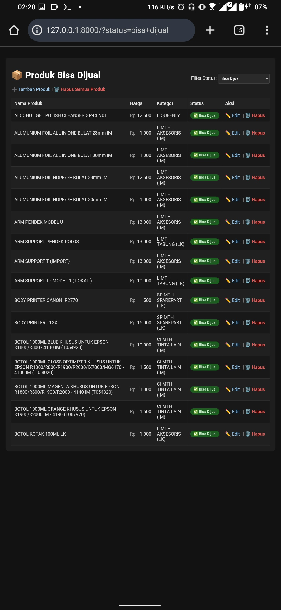
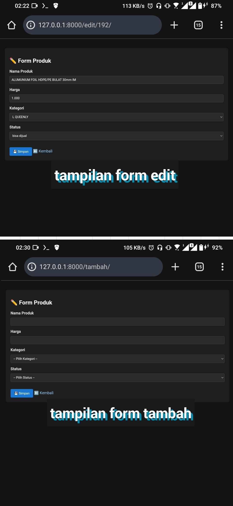
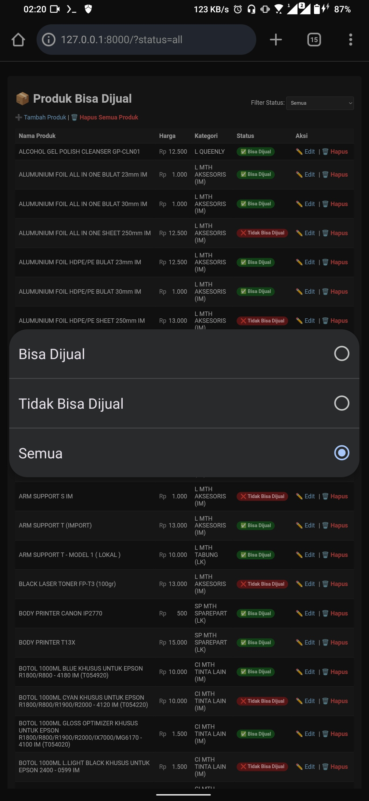
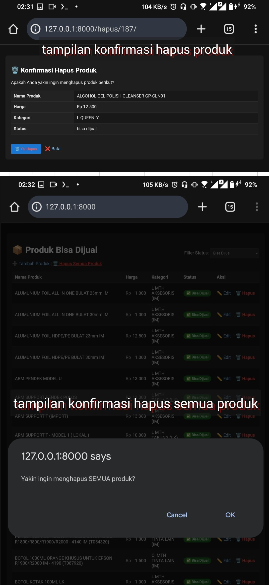

# 📦 Test Programmer – Product Management (Django)

Aplikasi web sederhana untuk manajemen produk menggunakan **Django**, **Django REST Framework (Serializer)**, dan **PostgreSQL**, dibuat sebagai bagian dari **Tes Junior Programmer FastPrint**.

🔗 **Link Soal Resmi**:  
[https://recruitment.fastprint.co.id/tes/tes/programmer/](https://recruitment.fastprint.co.id/tes/tes/programmer/)

---

## 🚀 Fitur Utama

- 🔄 Fetch data dari API FastPrint
- 🗄️ Simpan data ke PostgreSQL
- 📋 Tampilkan daftar produk
- 🎯 Filter berdasarkan status (Bisa Dijual / Tidak Bisa Dijual / Semua)
- ➕ Tambah produk
- ✏️ Edit produk
- 🗑️ Hapus produk (dengan konfirmasi)
- 🧹 Hapus semua produk (dengan konfirmasi)
- 🌙 UI Dark Mode
- 💰 Format harga Rupiah (1.000.000)
- 🎨 Status badge warna  
  - Hijau ✅ → Bisa Dijual  
  - Merah ❌ → Tidak Bisa Dijual

---

## 📸 Screenshot

> Halaman daftar produk (default: Bisa Dijual)



> Form tambah / edit produk



> Filter produk berdasarkan status



> Konfirmasi hapus data



----

## 📋 Soal Tes & Kesesuaian Implementasi

Link Soal Resmi:  
🔗 https://recruitment.fastprint.co.id/tes/tes/programmer/

Berikut adalah ringkasan **soal Tes Junior Programmer FastPrint** dan
**bagaimana implementasinya pada project ini**:

### Soal Tes

1. Mengambil data dari API yang disediakan  
2. Membuat database dengan tabel:
   - Produk (id_produk, nama_produk, harga, kategori_id, status_id)
   - Kategori (id_kategori, nama_kategori)
   - Status (id_status, nama_status)
3. Menyimpan data produk dari API
4. Menampilkan data yang sudah disimpan
5. Menampilkan produk dengan status **"bisa dijual"**
6. CRUD (Tambah, Edit, Hapus)
7. Validasi form:
   - Nama wajib diisi
   - Harga berupa angka
8. Konfirmasi saat hapus data
9. Menggunakan framework (Django disarankan)
10. Menggunakan PostgreSQL / MySQL
11. Dokumentasi lengkap

---

### Kesesuaian Implementasi

| Soal | Implementasi |
|----|----|
| Ambil data API | ✔️ Fetch API FastPrint + session |
| Database Produk/Kategori/Status | ✔️ PostgreSQL + Django ORM |
| Simpan data produk | ✔️ Service layer (`services.py`) |
| List produk | ✔️ `list.html` |
| Filter "bisa dijual" | ✔️ Default filter + select option |
| CRUD | ✔️ Tambah / Edit / Hapus |
| Validasi form | ✔️ DRF Serializer |
| Konfirmasi hapus | ✔️ JavaScript `confirm()` |
| Framework | ✔️ Django + DRF |
| Database | ✔️ PostgreSQL |
| Dokumentasi | ✔️ README + struktur project |

---

### API Endpoint

- **URL**:  
  https://recruitment.fastprint.co.id/tes/api_tes_programmer

- **Autentikasi**:
  - Username diambil dari response header `x-credentials-username`
  - Password dibuat dari format tanggal dan di-hash MD5
  - Login menggunakan **form-data**

> Catatan: Implementasi memperhatikan response, header, dan cookies sesuai hint soal.
> Kredensial API tidak disimpan permanen.
> Username diambil dari response header dan password di-generate secara dinamis sesuai ketentuan soal.

---

## 🧱 Teknologi yang Digunakan

- Python 3.12
- Django 6.0.1
- Django REST Framework (Serializer)
- PostgreSQL 18.1
- HTML + CSS (Dark Mode)
- Termux (Android environment)

---

## 🗂️ Struktur Project

```
test-FastPrint/
├── LICENSE
├── README.md
├── screenshots/
│   ├── list.png
│   ├── form.png
│   ├── filter.png
│   ├── delete-confirm.png
├── manage.py
├── config/
│   ├── settings.py
│   ├── urls.py
│   ├── asgi.py
│   └── wsgi.py
├── produk/
│   ├── admin.py
│   ├── apps.py
│   ├── models.py
│   ├── serializers.py
│   ├── services.py
│   ├── urls.py
│   ├── views.py
│   ├── migrations/
│   │   ├── 0001_initial.py
│   │   └── 0002_alter_kategori_table_alter_produk_table_and_more.py
│   └── templatetags/
│       └── format.py
├── templates/
│   └── produk/
│       ├── list.html
│       ├── form.html
│       └── error.html
├── static/
│   └── css/
│       └── dark.css
└── scripts/
    └── create_db.py
```

---

## 🗄️ Database

Menggunakan **PostgreSQL** (sesuai rekomendasi soal).

### Konfigurasi Database (`settings.py`)

```python
DATABASES = {
    'default': {
        'ENGINE': 'django.db.backends.postgresql',
        'NAME': 'renpwn_db',
        'USER': 'postgres',
        'PASSWORD': '',
        'HOST': 'localhost',
        'PORT': '5432',
    }
}
```

### Nama Tabel

- renpwn_kategori
- renpwn_status
- renpwn_produk

---

## 🔐 Autentikasi API FastPrint

1. Request pertama → ambil username dari header `x-credentials-username`
2. Password dibuat dari username (ambil tanggalnya saja), lalu di-hash MD5
3. Login menggunakan **form-data**

---

## 🔄 Fetch Data

- Tombol fetch selalu aktif
- Data tidak diduplikasi
- Jika sebagian data terhapus, fetch hanya menambahkan yang belum ada

---

## 🧪 Validasi Form

- Menggunakan **DRF Serializer**
- Nama produk wajib diisi
- Harga harus numerik
- Harga disimpan integer, diformat di template

---

## ▶️ Cara Menjalankan di Termux (Android)

### 1️⃣ Install dependency

```bash
pkg update
pkg install python postgresql git
pip install django djangorestframework psycopg2-binary requests
```

### 2️⃣ Jalankan PostgreSQL

```bash
pg_ctl -D $PREFIX/var/lib/postgresql start
```

### 3️⃣ Migration & Run server

```bash
python manage.py migrate
python manage.py runserver
```

Akses aplikasi:
```
http://127.0.0.1:8000/
```

---

## ▶️ Cara Menjalankan di Windows / Linux / macOS

### 1️⃣ Clone repository

```bash
git clone https://github.com/renpwn/test-FastPrint.git
cd test-FastPrint
```

### 2️⃣ Buat virtual environment (disarankan)

```bash
python -m venv venv
venv\Scripts\activate   # Windows
source venv/bin/activate # Linux / macOS
```

### 3️⃣ Install dependency

```bash
pip install django djangorestframework psycopg2-binary requests
```

### 4️⃣ Pastikan PostgreSQL berjalan

- Buat database `renpwn_db`
- Pastikan user & password sesuai `config/settings.py`

### 5️⃣ Migration & Run server

```bash
python manage.py migrate
python manage.py runserver
```

Akses aplikasi:
```
http://127.0.0.1:8000/
```

---

## 🖥️ Device & Tools yang Digunakan

### 📱 Device
- **Android Smartphone**
  - Android 11
  - Digunakan sebagai environment utama pengembangan dan testing aplikasi

### 🛠️ Tools & Environment
- **Termux**
  - Menjalankan Python, Django, dan PostgreSQL
  - Development backend, migration database, dan menjalankan server
- **Terminal / CLI**
  - Testing API
  - Menjalankan script Python
  - Manajemen database dan Git
- **Acode (Code Editor)**
  - Editing source code (Python, HTML, CSS)
- **Google Chrome**
  - Testing UI/UX aplikasi web
  - Validasi fitur CRUD dan filter data

### 🧪 Testing
- **API Testing**
  - Verifikasi response, header, dan cookies API FastPrint
- **Script Testing**
  - Pengujian service fetch data dan logic backend
- **Web Testing**
  - Pengujian form validasi, filter status, dan proses CRUD

> Catatan: Seluruh aplikasi dikembangkan dan diuji langsung menggunakan perangkat Android
> tanpa bantuan laptop/PC, dengan memanfaatkan Termux sebagai environment Linux.

---

## 👤 Pengalaman Kerja & Teknis

### • Web Programmer (±5+ tahun)
1. Mengembangkan aplikasi web menggunakan **PHP, JavaScript, Node.js, dan CodeIgniter**
2. Membangun dan memelihara **company profile, sistem ERP, dan aplikasi bisnis berbasis web**
3. Mengelola **server Linux (CentOS) tanpa cPanel**, termasuk deployment, keamanan, dan maintenance
4. Mengelola database **MySQL** dan **Cloud SQL (Google Cloud Platform)**

### • API & Sistem Terintegrasi
1. Implementasi **REST API** dan **SOAP API**
2. Integrasi pihak ketiga:
   - YouTube API  
   - WhatsApp Bot  
   - Telegram Bot  
   - Discord Bot  
   - Instagram Private API  
3. Pengolahan data **XML → JSON**, sinkronisasi sistem, dan integrasi pembayaran

### • Bot Automation & Multimedia
1. Mengembangkan bot edukatif lintas platform (**WhatsApp, Telegram, Discord**)
2. Distribusi konten **Al-Qur’an, JLPT, HSK, Hadis**, dll dalam bentuk teks, audio, dan video
3. Pemrosesan multimedia menggunakan **ffmpeg** (audio processing, subtitle, video otomatis)

### • Freelance & Proyek Independen
1. Web developer freelance untuk berbagai klien
2. Membangun **sistem informasi, aplikasi CRUD, dan website dinamis**
3. Admin marketplace (**Shopee & Tokopedia**):
   - Manajemen produk  
   - Konten  
   - Komunikasi pelanggan  

### • Open Source & Library (NPM Publisher)
_Mengembangkan dan memelihara library Node.js:_

1. **[@renpwn/baileys-store](https://www.npmjs.com/package/@renpwn/baileys-store)** — WhatsApp bot state management  
2. **[@renpwn/fb-downloader](https://www.npmjs.com/package/@renpwn/fb-downloader)** — Facebook HD video downloader  
3. **[@renpwn/termux-sqlite3](https://www.npmjs.com/package/@renpwn/termux-sqlite3)** — SQLite performa tinggi untuk Termux  
4. **[@renpwn/alquran.js](https://www.npmjs.com/package/@renpwn/alquran.js)** — Al-Qur’an database + Full-Text Search (FTS)  
5. **[@renpwn/simplelog](https://www.npmjs.com/package/@renpwn/simplelog)** — Audit‑friendly logger untuk Node.js  

_Terbiasa membuat library **reusable, stabil, dan siap produksi**._

---

## 📄 License

MIT License  

**Copyright © Ardy Rendra Rakasiwi**  
Sepanjang, Sidoarjo, Indonesia
